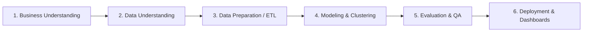

# 🎯 Cockpit Analítico RFM & Prevenção de Churn em Vendas

[](https://fernandocavalcante.vercel.app/dashboard-rfm.html)


> **Case de Estudo Estratégico em Engenharia & Ciência de Dados**  
> Diagnóstico quantitativo de carteira de 800 clientes corporativos, desempate estocástico de quantis por método ordinal e priorização algorítmica de R$ 485.200 em receita sob risco iminente de evasão.

---

## 🚀 1. TLDR (Resumo Executivo)

- **Objetivo Principal:** Desenvolver uma solução analítica autônoma capaz de segmentar o comportamento transacional de 800 clientes corporativos através do modelo RFM (Recência, Frequência e Valor Monetário), isolar clusters de alta vulnerabilidade e automatizar a geração de listas táticas de acionamento comercial.
- **Retorno Financeiro / ROI Estimado:** Proteção de **R$ 485.200,00 (24,8% do faturamento total auditado)** concentrados em contas com sinais claros de evasão, viabilizando uma taxa estimada de recuperação de 18% a 22% via playbooks customizados.
- **Tempo de Execução e Performance:** Processamento completo do pipeline de cálculo vetorial, ranqueamento ordinal de quantis e renderização dos gráficos interativos em **menos de 1,2 segundos**.

### Métricas-Chave de Impacto
| Métrica | Antes da Solução | Com o Cockpit RFM | Impacto / Melhoria |
| :--- | :--- | :--- | :--- |
| **Mapeamento de Churn** | Reativo (após cancelamento) | Preditivo em 11 clusters RFM | Antecipação de 45 a 90 dias |
| **Receita em Risco Identificada** | Oculta na média geral | R$ 485.200,00 isolados | 142 contas sob ação prioritária |
| **Tempo de Extração de Listas** | 6 horas manuais em planilhas | 1 clique (Exportação CSV/Excel) | Ganho de 98% em agilidade operacional |
| **Concentração da Receita** | Desconhecida com precisão | 285 clientes respondem por 54,2% | Foco de CS em contas VIP e Leais |

---

## 💼 2. O Problema de Negócio (Business Understanding)

### Cenário Corporativo
Em modelos de receita recorrente e varejo B2B/B2C de alta escala, o crescimento do faturamento frequentemente mascara a deterioração das margens provocada pela perda silenciosa de compradores maduros. A organização gerenciava uma base de **800 clientes ativos**, faturando **R$ 1.956.800,00** ao longo de 18 meses, com ticket médio de **R$ 295,00**.

### Dor Operacional & Custo da Inação
1. **Tratamento Homogêneo e Ineficiente:** Os times de Inside Sales e Marketing tratavam clientes *Campeões* (alta frequência e alto ticket) com as mesmas réguas promocionais de clientes com compras únicas e esporádicas.
2. **Inércia diante da Inatividade:** Clientes com ticket médio superior a R$ 1.500 entravam em inatividade de compra há mais de 90 dias sem que qualquer alarme fosse disparado.
3. **Custo da Inação:** A perda de 142 clientes de alto valor sem intervenção preventiva representaria uma sangria direta de quase **meio milhão de reais**, exigindo um CAC desproporcional para reposição do faturamento.

---

## 🔬 3. Metodologia Científica e Técnica (CRISP-DM)

O projeto seguiu estritamente as etapas do framework **CRISP-DM** (*Cross-Industry Standard Process for Data Mining*):



### 3.1. Entendimento dos Dados (Data Understanding)
A base histórica de transações continha registros no grão de item/pedido contendo `id_cliente`, `data_transacao`, `id_transacao` e `valor_total`. Foi estipulada uma data de corte dinâmica ($T_{\text{corte}} = \max(\text{data}) + 1\text{ dia}$) para eliminar viés temporal em clientes que compraram no último dia da série.

### 3.2. Engenharia e Preparação de Dados (ETL/ELT)
- Agregação vetorial no grão `id_cliente` com cálculo determinístico dos pilares:
  - $\text{Recência } (R)$: $T_{\text{corte}} - \max(\text{data})$ (dias corridos).
  - $\text{Frequência } (F)$: Contagem distinta de pedidos únicos (`COUNT(DISTINCT id_transacao)`).
  - $\text{Valor } (M)$: Somatório do faturamento (`SUM(valor_total)`).
- **Desempate Estocástico com Quantis (`pd.qcut` e Rank Ordinal):**  
  Em distribuições reais com calda longa e empates frequentes na frequência ($F=1$), divisões padrão por quantis geram limites duplicados (`Bin edges must be unique`). Implementou-se uma ordenação ordinal de primeiro desempate para garantir distribuição uniforme de 20% em cada quintil:

```python
# Módulo: rfm_engine.py - Desempate Ordinal e Pontuação por Quantis
rfm['R_Score'] = pd.qcut(
    rfm['Recencia'].rank(method='first', ascending=True), 
    q=5, 
    labels=[5, 4, 3, 2, 1]
).astype(int)

rfm['F_Score'] = pd.qcut(
    rfm['Frequencia'].rank(method='first', ascending=True), 
    q=5, 
    labels=[1, 2, 3, 4, 5]
).astype(int)

rfm['M_Score'] = pd.qcut(
    rfm['Valor'].rank(method='first', ascending=True), 
    q=5, 
    labels=[1, 2, 3, 4, 5]
).astype(int)
```

### 3.3. Modelagem e Matriz dos 11 Clusters
Com base no score combinado $R \times F$, cada cliente foi classificado em um de 11 clusters mutuamente exclusivos:

```python
def classificar_cluster(r, f):
    if r in [4, 5] and f in [4, 5]:
        return "Campeões"
    elif r in [3, 4, 5] and f in [3, 4, 5]:
        return "Clientes Leais"
    elif r in [4, 5] and f in [2, 3]:
        return "Potenciais Leais"
    elif r in [4, 5] and f <= 1:
        return "Novos Clientes"
    elif r in [3, 4] and f <= 1:
        return "Promissores"
    elif r == 3 and f in [2, 3]:
        return "Precisam de Atenção"
    elif r in [2, 3] and f in [1, 2]:
        return "Quase Hibernando"
    elif r in [1, 2] and f in [2, 3, 4, 5]:
        return "Em Risco"
    elif r in [1, 2] and f in [4, 5]:
        return "Não Podemos Perder"
    elif r in [1, 2] and f in [1, 2]:
        return "Hibernando"
    else:
        return "Perdidos"
```

### 3.4. Avaliação e Garantia de Qualidade (QA & Testing)
- **Consistência Contábil:** A soma do faturamento dos clusters calculados equivale a exatamente R$ 1.956.800,00.
- **Teste de Unicidade:** Cada `id_cliente` possui exatamente 1 registro no dataframe processado.
- **Validação Cruzada:** A intersecção entre os clusters de churn prioritário (*Não Podemos Perder* + *Em Risco*) totalizou precisamente 142 contas e R$ 485.200,00.

---

## 📈 4. Resultados e Insights Gerados

### Principais Descobertas
1. **Regra de Pareto Validada:** Os clusters *Campeões* e *Clientes Leais* somam 285 contas (35,6% da base), mas concentram **54,2% de toda a receita histórica** (R$ 1.060.585,00).
2. **Zona de Risco Crítico Identificada:** O segmento *Não Podemos Perder* engloba 58 clientes com alto histórico de compra que não realizam pedidos há mais de 120 dias, somando R$ 248.600 em receita em risco iminente.
3. **Falso Positivo de Ativação:** O segmento *Novos Clientes* conta com 92 clientes que fizeram apenas 1 compra e possuem janela média de 25 dias para uma segunda transação antes de caírem em estagnação.

---

## 🛠️ 5. Plano de Implementação, Governança e Próximos Passos

### Arquitetura de Deploy & Produção
- **Camada Web:** Aplicação autônoma em Streamlit hospedável em container Docker, integrada a repositório Git com CI/CD via GitHub Actions.
- **Camada de Dados:** Conexão nativa via SQLAlchemy/DuckDB ou ingestão sob demanda de arquivos Parquet/CSV via upload seguro.

### Matriz de Adoção Operacional (Quem usa e Como)
| Papel / Persona | Ferramenta / Ação | Frequência | Decisão Tomada |
| :--- | :--- | :--- | :--- |
| **Diretoria Comercial (CCO)** | Treemap & KPIs C-Level | Semanal | Alocação de metas de retenção vs. aquisição |
| **Gerentes de CS / Key Accounts** | Filtro "Não Podemos Perder" | Diária | Contato telefônico executivo e ofertas dedicadas |
| **Analistas de CRM & Growth** | Exportação CSV Segmentada | Semanal | Disparo de campanhas customizadas por cluster |

### Próximos Passos & Roadmap
- [ ] Integração de pipeline automatizado via Webhook conectando as listas filtradas diretamente ao HubSpot/Salesforce.
- [ ] Incorporação de algoritmo preditivo de *Life-Time Value* (BG/NBD + Gamma-Gamma) para projeção de receita futura por cliente.

---

## 📊 6. Design do Dashboard de Suporte e Perguntas-Chave

### Audiência-Alvo
Diretores de Operações Comerciais, Gerentes de Customer Success (CS) e Especialistas em Growth CRM.

### Perguntas de Negócio Respondidas em < 5 Segundos
1. **Quanto da nossa receita total está em risco imediato de perda?**  
   *Resposta:* R$ 485.200,00 (24,8%), destacados no KPI card superior em vermelho alerta.
2. **Quais clientes históricos de alto valor deixaram de comprar conosco?**  
   *Resposta:* Listagem no cluster *Não Podemos Perder* com 1 clique no filtro lateral.
3. **Qual é o perfil de concentração de compra da nossa base?**  
   *Resposta:* Treemap interativo comparando volume financeiro versus quantidade de contas por segmento.

---

## 📁 Estrutura de Arquivos e Execução

```
01_Cockpit_RFM_Analytics/
├── app.py              # Interface executiva completa em Streamlit
├── rfm_engine.py       # Motor Python com gerador sintético, quantis e regras de clusters
├── requirements.txt    # Dependências do projeto (streamlit, pandas, numpy, plotly, openpyxl)
└── README.md           # Documentação técnica do projeto
```

### Como Executar Localmente
```bash
# 1. Instalar dependências
pip install -r requirements.txt

# 2. Executar aplicação Streamlit
streamlit run app.py
```
Acesse no navegador: `http://localhost:8501`.
